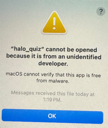

**Welcome to the Halo Quiz setup guide!**

This guide will walk you through the process of getting the quiz to run
on your computer. Due to a lot of technical stuff and my lack of
credentials with Apple, if you were simply try to open the app I just
sent you, you would receive some errors, such as this one:

To avoid this, we will have to move the file, grant it special
permissions, and open the file with a certain app. It sounds more
complicated than it is, it will only take a minute.

    NOTE: This software was developed and tested on MacOS. To my 
    participants with Windows, I am sorry. For the time being, buddy 
    up with someone with MacOS or just buy a real computer.

**_Instructions_**

    Step 1: Open up your Mac, and find the file that I sent you
    (probably in your Messages) titled "halo_quiz".
    
    Step 2: "Right" click (click with two fingers on your touchpad) 
    the file.
    
    Step 3: Click "Save to Downloads".

    Step 4: Open up Finder and navigate to your Downloads folder.

    Step 5: